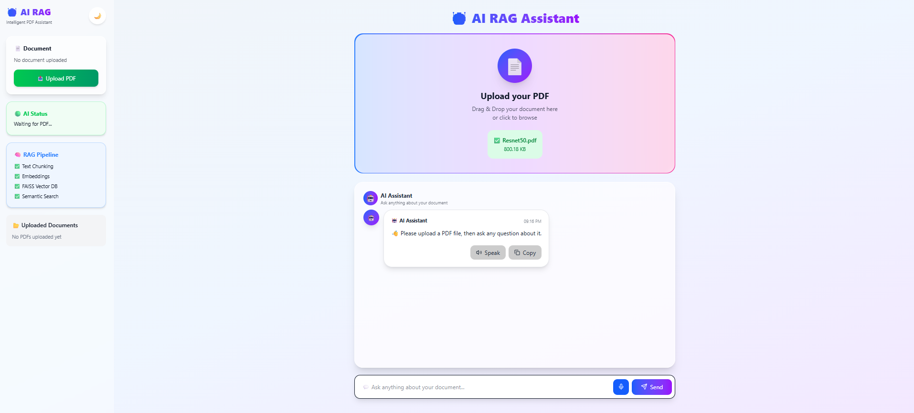
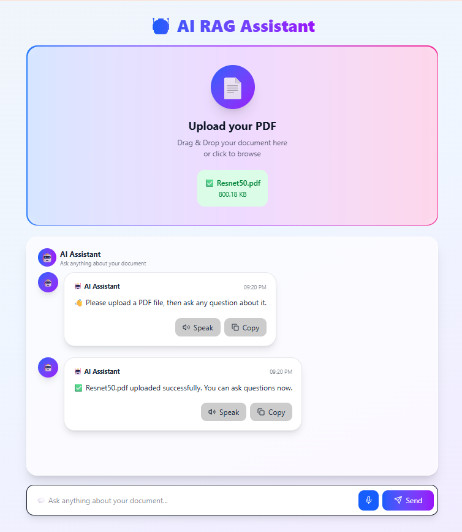
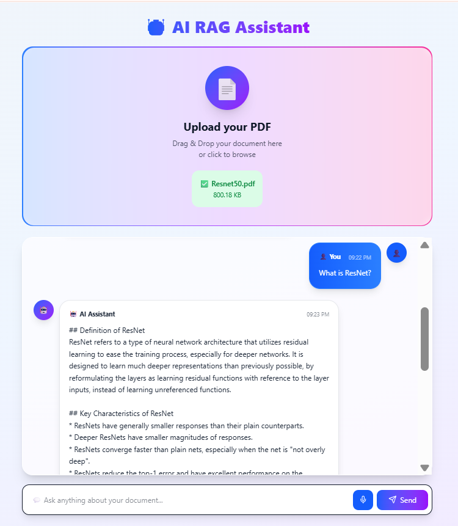
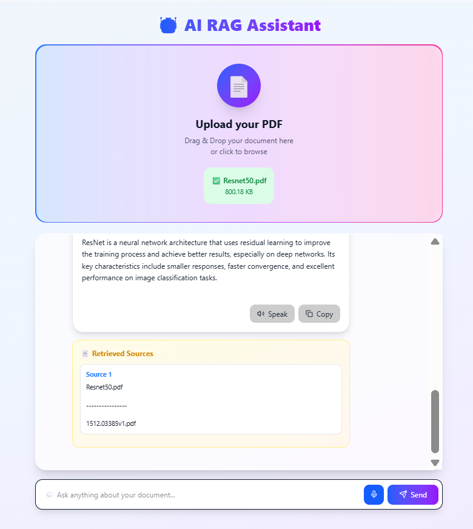

# 🤖 AI RAG Assistant

An AI-powered Retrieval-Augmented Generation (RAG) application that enables users to upload PDF documents and ask questions in natural language. The system retrieves the most relevant information using semantic search and generates accurate, context-aware answers with the Llama 3.3 Large Language Model.

---

## 🚀 Live Demo

🌐 **Website:** https://ai-rag-assistant-seven.vercel.app

⚡ **Backend API:** https://nouraelhoseny13-ai-rag-assistant-backend.hf.space

---

## 📸 Project Screenshots

### 🏠 Home Page



---

### 📤 Upload PDF



---

### 💬 AI Chat



---

### 📚 Retrieved Sources



---

## ✨ Features

- Upload PDF documents
- Automatic text extraction
- Intelligent text chunking
- Generate embeddings using Sentence Transformers
- Semantic Search using FAISS
- AI-powered Question Answering
- Document Summarization
- Multiple Question Support
- Source Citation
- Fast and Responsive User Interface

---

## 🛠️ Tech Stack

### Frontend

- React
- Vite
- CSS3
- Axios

### Backend

- Python
- FastAPI
- FAISS
- Sentence Transformers
- PyPDF
- Groq API (Llama 3.3)

### Deployment

- Vercel (Frontend)
- Hugging Face Spaces (Backend)

---

## ⚙️ How It Works

1. Upload a PDF document.
2. Extract text from the document.
3. Split the text into semantic chunks.
4. Generate vector embeddings.
5. Store the embeddings using FAISS.
6. Retrieve the most relevant chunks based on the user's question.
7. Generate an answer using the Llama 3.3 language model.
8. Display the answer along with the retrieved source document.

---

## 📂 Project Structure

```text
AI-RAG-Assistant/
│
├── assets/
│   ├── home.png
│   ├── upload.png
│   ├── chat.png
│   └── sources.png
├── frontend/
├── backend/
├── README.md
└── .gitignore
```

---

## 💡 Future Improvements

- Hybrid Search (FAISS + BM25)
- Cross-Encoder Re-ranking
- Multi-document Retrieval
- Chat History
- User Authentication
- Support for DOCX and TXT files

---

## 👩‍💻 Author

**Noura Elhoseny**

🔗 **LinkedIn:** https://www.linkedin.com/in/noura-elhoseny-ba59212aa

💻 **GitHub:** https://github.com/nouraelhoseny13-blip
